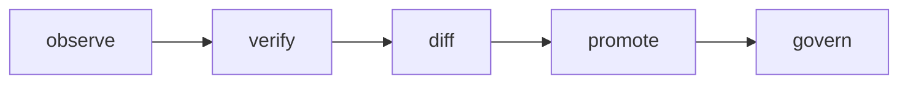

# Jeremy Capps

**I turn how work actually happens into systems that agents can run, verify, and reuse.**

Operator and engineer — nine years across operations, product, design, and engineering. For the past year I've been building one thing from several angles: the substrate for capturing expert work as inspectable, verifiable, reusable state, and handing it to agents.

## What I build

It's one system — an **agent environment with a verifier at its center**. Each layer is its own small, versioned protocol:

| Layer | What it does | Repo |
|---|---|---|
| **agent environment** | mounts operational context as an agent-navigable filesystem | [domain-os](https://github.com/jeremycapps/domain-os) |
| **trajectory store** | records, replays, and diffs state changes at addressable paths | [timpos](https://github.com/jeremycapps/timpos) |
| **answer schema** | the typed vocabulary for answers and state — value · verdict · operation · convergence, × arity | [facia](https://github.com/jeremycapps/facia) |
| **verifier** | declares the expected state and grades the actual against it | [corus](https://github.com/jeremycapps/corus) |
| **runtime** | executes the models deterministically; plans queries and binds meaning | [libera](https://github.com/jeremycapps/libera) |
| **retrieval** | result-conditioned search that converges on an answer, or defers | [query-compiler-induced](https://www.jeremycapps.com/blog/query-compiler-induced) |
| **tools (MCP)** | a lineage-backed decision log · a provenance-attached knowledge base | [cord-mcp](https://github.com/jeremycapps/cord-mcp) · [experience-mcp-server](https://github.com/jeremycapps/experience-mcp-server) |

The through-line: record what happened, declare what should be true, and treat the **diff between them as the work**.

## How I work

Observe the real trajectories, separate the deterministic sub-decision from the judgment one, promote only the safe part to tooling, and leave the check running. Same loop at every scale.

Most recent, smallest scale: I mined 140 of my own agent sessions, found one wasteful pattern — unscoped recursive search — and routed it. **~250× faster, ~10× less context, zero model change**, gated behind a 19-case test suite. The interesting part wasn't the speed; it was that 99.6% of the win was scope and consolidation, not a faster tool. Write-up: [routing grep → git grep](https://github.com/jeremycapps/portfolio/blob/main/docs/grep-routing-experiment.md).

## Currently

Strategic Projects Lead at Aroko. Writing and case studies at [jeremycapps.com](https://www.jeremycapps.com).
